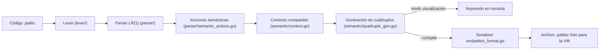
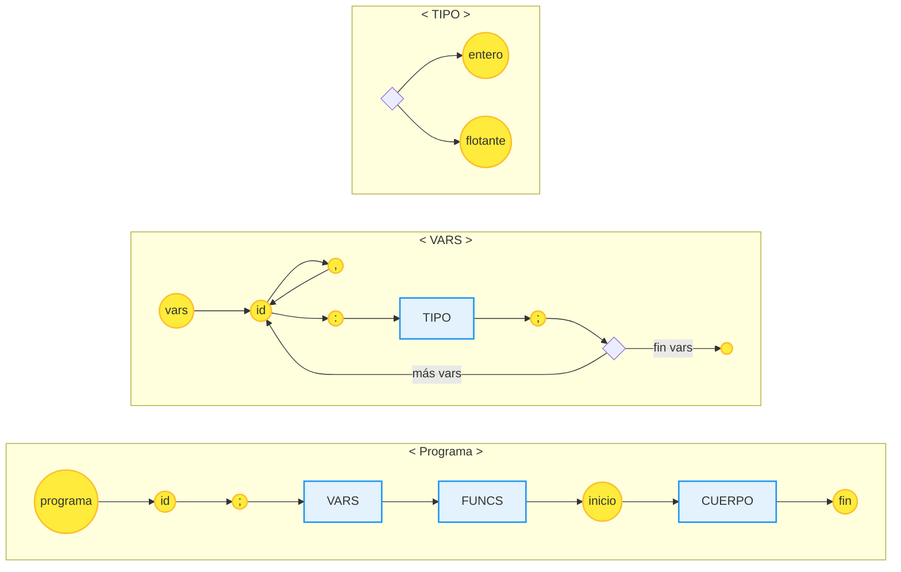
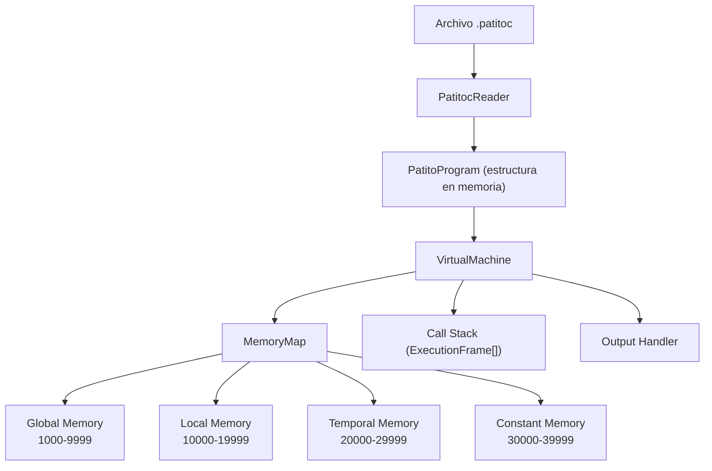
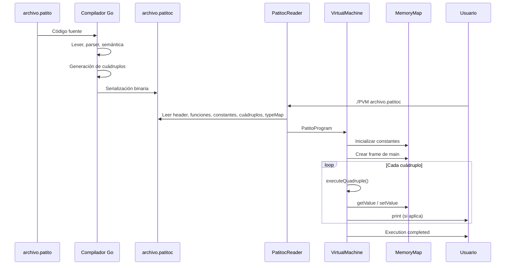

# Documentación integral del compilador Patito

Este documento consolida todas las decisiones de diseño, la gramática completa, los flujos de trabajo y los artefactos del proyecto `TC3002B-M3-Patito`. La intención es que cualquier desarrollador pueda comprender y extender el compilador con rapidez; el contenido está listo para publicarse en internet sin depender de contexto adicional.

---

## 1. Propósito y alcance

- **Objetivo**: implementar un compilador completo para el lenguaje académico **Patito** en Go, desde el análisis léxico hasta la generación de cuádruplos y la serialización binaria (`.patitoc`).
- **Fases cubiertas**:
  1. Lexer y parser LR(1) generados con `gocc` a partir de `patito.bnf`.
  2. Acciones semánticas que construyen directorios de símbolos, validan tipos y crean cuádruplos.
  3. Administración de memoria virtual (global, local, temporal, constante).
  4. Exportación opcional del código intermedio para una máquina virtual.
- **Entrada esperada**: archivos `.patito` con la forma `program <id>; ... main { ... } end`.

---

## 2. Dependencias y configuración

| Dependencia | Versión mínima | Uso |
| --- | --- | --- |
| Go | 1.25 | Compilar y ejecutar el proyecto y las pruebas. |
| `goccmack/gocc` | 3.x | Regenerar `lexer/`, `parser/`, `token/` y `util/` a partir de `patito.bnf`. |
| `stretchr/testify` | latest | Fixtures y aserciones en `patito_test/`. |

### Instalación rápida

```bash
brew install go # si aún no se tiene
go install github.com/goccmack/gocc@latest
```

### Regenerar lexer y parser

```bash
cd /Users/santiagoquihui/Developer/TC3002B-M3-Patito
gocc patito.bnf
```

---

## 3. Estructura del repositorio

```
.
├── ast/                     # Interfaz mínima que gocc espera para un AST.
├── errors/                  # Manejadores de errores generados por gocc.
├── lexer/, parser/, token/, util/  # Artefactos generados vía gocc.
├── semantic/                # Contexto, tablas, cubo semántico y generación de cuádruplos.
├── vm/                      # Serialización al formato .patitoc.
├── pkg/parser/              # Adapter liviano usado por las pruebas.
├── patito_test/             # Suites con testify para gramática y semántica.
├── test_programs/           # Programas de ejemplo + .patitoc esperados.
├── main.go                  # Punto de entrada (CLI).
├── patito.bnf               # Gramática completa (léxico + sintaxis).
└── ENTREGA{1-4}.md          # Documentos históricos por entrega.
```

---

## 4. Flujo extremo a extremo



---

## 5. Gramática completa de Patito (`patito.bnf`)

### 5.1 Léxico relevante

- **Identificadores**: `id = (letra | '_')(letra | dígito | '_')*`
- **Constantes**: `cte_int`, `cte_float`, `cte_string`
- **Palabras clave**: `program`, `var`, `main`, `if`, `else`, `while`, `do`, `print`, `return`, `void`, tipos `int|float`
- **Operadores**: `+ - * / > < != == =`
- **Ignorados**: espacio, tabulaciones, saltos de línea, comentarios `//` y `/* */`

### 5.2 Diagramas en Mermaid (Estilo Ferrocarril)

Estos diagramas representan la gramática formal del lenguaje Patito, divididos por módulos para facilitar la lectura, siguiendo el flujo horizontal original.

#### A. Estructura General y Variables
Define la estructura base del programa (`<Programa>`), la declaración de variables globales/locales (`<VARS>`) y los tipos de datos (`<TIPO>`).



#### Diagrama B · Funciones y Cuerpo
Define la declaración de funciones (<FUNCS>) y el bloque principal de código (<CUERPO>).

```mermaid
graph LR
    classDef terminal fill:#ffeb3b,stroke:#fbc02d,stroke-width:2px,rx:10,ry:10;
    classDef nonterminal fill:#e3f2fd,stroke:#2196f3,stroke-width:2px;

    %% --- FUNCS ---
    subgraph S_FUNCS ["< FUNCS >"]
        direction LR
        F_Choice{ } --> F_Void((nula))
        F_Choice --> F_Type[TIPO]
        
        F_Void --> F_Id((id))
        F_Type --> F_Id
        
        F_Id --> F_OP(( "(" ))
        F_OP --> F_Args{Args?}
        F_Args --> F_P_Id((id))
        F_P_Id --> F_Colon((:))
        F_Colon --> F_P_Type[TIPO]
        F_P_Type --> F_Comma((,))
        F_Comma --> F_P_Id
        F_P_Type --> F_CP(( ")" ))
        F_Args -->|vacio| F_CP
        
        F_CP --> F_OB(( { ))
        F_OB --> F_VARS[VARS]
        F_VARS --> F_Body[CUERPO]
        F_Body --> F_CB(( } ))
        
        F_CB --> F_Loop(( ; ))
        F_Loop -->|otra func| F_Choice
        F_Loop -->|fin funcs| F_End(( ))
    end

    %% --- CUERPO ---
    subgraph S_CUERPO ["< CUERPO >"]
        direction LR
        C_Start(( { )) --> C_Stat[ESTATUTO]
        C_Stat --> C_More{ }
        C_More -->|más| C_Stat
        C_More --> C_End(( } ))
    end

    class F_Void,F_Id,F_OP,F_P_Id,F_Colon,F_Comma,F_CP,F_OB,F_CB,F_Loop,F_End,C_Start,C_End terminal;
    class F_Type,F_P_Type,F_VARS,F_Body,C_Stat nonterminal;
```

#### Diagrama C · Estatutos (Sentencias)

Detalle de las acciones posibles dentro de un cuerpo: Asignación, Lectura, Escritura, etc.

```mermaid
graph LR
    classDef terminal fill:#ffeb3b,stroke:#fbc02d,stroke-width:2px,rx:10,ry:10;
    classDef nonterminal fill:#e3f2fd,stroke:#2196f3,stroke-width:2px;

    %% --- ESTATUTO ---
    subgraph S_EST ["< ESTATUTO >"]
        direction LR
        E_Start{ } --> E_Asig[ASIGNA]
        E_Start --> E_Cond[CONDICIÓN]
        E_Start --> E_Cicl[CICLO]
        E_Start --> E_Llam[LLAMADA]
        E_Llam --> E_Semi((;))
        E_Start --> E_Imp[IMPRIME]
    end

    %% --- ASIGNA ---
    subgraph S_ASIG ["< ASIGNA >"]
        direction LR
        A_Id((id)) --> A_Eq((=))
        A_Eq --> A_Exp[EXPRESIÓN]
        A_Exp --> A_Semi((;))
    end

    %% --- IMPRIME ---
    subgraph S_IMP ["< IMPRIME >"]
        direction LR
        I_Wri((escribe)) --> I_OP(( "(" ))
        I_OP --> I_Choice{ }
        I_Choice --> I_Exp[EXPRESIÓN]
        I_Choice --> I_Str((letrero))
        I_Exp --> I_Comma((,))
        I_Str --> I_Comma
        I_Comma --> I_Choice
        I_Exp --> I_CP(( ")" ))
        I_Str --> I_CP
        I_CP --> I_Semi_Imp((;))
    end

    class E_Semi,A_Id,A_Eq,A_Semi,I_Wri,I_OP,I_Str,I_Comma,I_CP,I_Semi_Imp terminal;
    class E_Asig,E_Cond,E_Cicl,E_Llam,E_Imp,A_Exp,I_Exp nonterminal;
```

#### Diagrama D · Control de Flujo
```
graph LR
    classDef terminal fill:#ffeb3b,stroke:#fbc02d,stroke-width:2px,rx:10,ry:10;
    classDef nonterminal fill:#e3f2fd,stroke:#2196f3,stroke-width:2px;

    %% --- CICLO ---
    subgraph S_CICLO ["< CICLO >"]
        direction LR
        W_While((mientras)) --> W_OP(( "(" ))
        W_OP --> W_Exp[EXPRESIÓN]
        W_Exp --> W_CP(( ")" ))
        W_CP --> W_Do((haz))
        W_Do --> W_Body[CUERPO]
        W_Body --> W_Semi((;))
    end

    %% --- CONDICION ---
    subgraph S_COND ["< CONDICIÓN >"]
        direction LR
        IF_Si((si)) --> IF_OP(( "(" ))
        IF_OP --> IF_Exp[EXPRESIÓN]
        IF_Exp --> IF_CP(( ")" ))
        IF_CP --> IF_Body[CUERPO]
        IF_Body --> IF_Semi((;))
        
        IF_Body --> IF_Else((sino))
        IF_Else --> IF_BodyElse[CUERPO]
        IF_BodyElse --> IF_Semi
    end

    class W_While,W_OP,W_CP,W_Do,W_Semi,IF_Si,IF_OP,IF_CP,IF_Semi,IF_Else terminal;
    class W_Exp,W_Body,IF_Exp,IF_Body,IF_BodyElse nonterminal;
```

#### Diagrama E · Expresiones y Matemáticas

Jerarquía completa de operaciones aritméticas y lógicas: EXPRESIÓN > EXP > TÉRMINO > FACTOR.

```
graph LR
    classDef terminal fill:#ffeb3b,stroke:#fbc02d,stroke-width:2px,rx:10,ry:10;
    classDef nonterminal fill:#e3f2fd,stroke:#2196f3,stroke-width:2px;

    %% --- EXPRESION ---
    subgraph S_EXPR ["< EXPRESIÓN >"]
        direction LR
        EX_Exp[EXP] --> EX_Op{ > < != == }
        EX_Op --> EX_Exp2[EXP]
        EX_Exp --> EX_End(( ))
        EX_Exp2 --> EX_End
    end

    %% --- EXP (Suma/Resta) ---
    subgraph S_EXP ["< EXP >"]
        direction LR
        E_Term[TÉRMINO] --> E_Op{ + - }
        E_Op --> E_Term
    end

    %% --- TÉRMINO (Mult/Div) ---
    subgraph S_TERM ["< TÉRMINO >"]
        direction LR
        T_Fact[FACTOR] --> T_Op{ * / }
        T_Op --> T_Fact
    end

    %% --- FACTOR ---
    subgraph S_FACT ["< FACTOR >"]
        direction LR
        F_Choice{ }
        F_Choice --> F_OP(( "(" )) 
        F_OP --> F_Expr[EXPRESIÓN]
        F_Expr --> F_CP(( ")" ))
        
        F_Choice --> F_Sign{+ -}
        F_Sign --> F_Val
        F_Choice --> F_Val
        
        F_Val{ } --> F_Id((id))
        F_Val --> F_Int((cte_ent))
        F_Val --> F_Float((cte_flot))
        
        %% LLAMADA está implícita en ID segun el diagrama original,
        %% pero aquí se conecta explícitamente para claridad
        F_Id --> F_Llam[LLAMADA]
    end

    %% --- LLAMADA ---
    subgraph S_CALL ["< LLAMADA >"]
        direction LR
        L_Id((id)) --> L_OP(( "(" ))
        L_OP --> L_Exp[EXPRESIÓN]
        L_Exp --> L_Comma((,))
        L_Comma --> L_Exp
        L_Exp --> L_CP(( ")" ))
        L_OP --> L_CP
    end

    class EX_Op,EX_End,E_Op,T_Op,F_OP,F_CP,F_Id,F_Int,F_Float,L_Id,L_OP,L_Comma,L_CP terminal;
    class EX_Exp,EX_Exp2,E_Term,T_Fact,F_Expr,F_Llam,L_Exp nonterminal;
```

Estructuras para la toma de decisiones (<CONDICIÓN>) y repetición (<CICLO>).

Los nodos coloreados representan las producciones `<< >>` conectadas a acciones semánticas en el parser: ahí se invoca código Go inmediatamente al reducir la producción.

### 5.3 Puntos neurálgicos (producciones `<< >>`)

| Producción gocc | Hook semántico | Cuádruplos / efectos |
| --- | --- | --- |
| `IF_MARK` | Evalúa la condición ya apilada y genera `GOTOF` con destino pendiente. | Reserva el salto falso del `if`. |
| `ELSE_MARK` | Completa el `GOTOF` del `if` y emite `GOTO` para saltar el bloque `else`. | Resuelve el inicio del `else` y apila el salto final. |
| `WHILE_MARK` | Después de evaluar la condición, guarda el índice del ciclo y crea el `GOTOF`. | Produce el par `(inicio, salto)` usado para cerrar el `while`. |
| `ADD_MARK` / `SUB_MARK` | Empujan `+` y `-` a la pila de operadores respetando precedencia. | Disparan reducciones aritméticas y temporales. |
| `MUL_MARK` / `DIV_MARK` | Idem para `*` y `/`. | Mantienen el orden correcto antes de generar cuádruplos. |

Las implementaciones exactas de estos hooks se muestran en la sección 7.

---

## 6. Componentes principales

### 6.1 Lexer, parser y adaptadores

- `patito.bnf` alimenta a `gocc`, quien produce `lexer/`, `parser/`, `token/` y `util/`.
- `parser/semantic_actions.go` registra ~80 `reduce` callbacks que invocan funciones del paquete `semantic`.
- `pkg/parser/` ofrece `MustBuildParser()` y `ParseString()` para que las pruebas interactúen con el parser sin depender de tipos generados.

### 6.2 Contexto semántico (`semantic/context.go`)

`semantic.Context` encapsula todo el estado compartido: directorio de funciones, cubo semántico, fila de cuádruplos, pilas de operadores/operandos/tipos/saltos, contador de temporales, tabla de constantes y buffers temporales (`VariableTypes`/`VariableAddresses`) que permiten resolver símbolos antes de que la reducción finalice. También rastrea `FunctionStartQuads`, `ProgramStartGotoIndex` y `MainStartIndex` para completar gotos atrasados.

### 6.3 Directorio de funciones y tablas de símbolos (`semantic/directory.go`)

- `FunctionDirectory` centraliza `Globals` y `Functions`.
- Cada `FunctionEntry` registra `Params`, `Locals`, tipo de retorno y una bandera `Finalized`.
- Las direcciones virtuales se asignan vía `VirtualAddressManager`: globales `NextGlobal()`, parámetros/locales `NextLocal()`, temporales `NextTemporal()`.
- Métodos clave: `SetProgram`, `AddGlobals`, `AddFunction`, `FinalizeFunction`, `GetVariableType`, `GetVariableAddress`.

### 6.4 Cubo semántico y sistema de tipos (`semantic/cube.go`, `semantic/types.go`)

- Tipos soportados: `int`, `float`, `void`, `bool`, `string`.
- `SemanticCube` almacena compatibilidades en un mapa `op -> tipoIzq -> tipoDer -> tipoResultado`.
- Operadores aritméticos permiten promociones `int→float`; relacionales producen `bool`; asignaciones válidas se validan antes de generar cuádruplos.

### 6.5 Generación de cuádruplos (`semantic/quadruple_gen.go`, `semantic/quadruples.go`)

- Pila de operadores con precedencia para `+, -, *, /` y relacionales; `ProcessExpressionEnd` drena operaciones pendientes.
- Cuádruplos `(operador, op1, op2, resultado)`:
  - Aritmética produce temporales (`TempCounter`).
  - Relacionales generan temporales booleanos.
  - `GOTOF`, `GOTO`, `GOSUB`, `PARAM`, `RETURN`, `ENDFUNC`, `END` modelan control de flujo y funciones.
- `ProcessProgramStart` inserta el `GOTO main` que se completa al localizar `main`.

### 6.6 Tabla de constantes (`semantic/constant_table.go`)

- Deduplica literales `int`, `float` y `string`.
- Cada `ConstantEntry` guarda `Value`, `Type`, `Address` (rango 30000-39999).
- `vm/writeConstants` serializa la tabla sin transformaciones adicionales.

### 6.7 Direcciones virtuales (`semantic/virtual_address.go`)

| Segmento | Rango | Uso |
| --- | --- | --- |
| Global | 1000–9999 | Variables globales. |
| Local | 10000–19999 | Parámetros y locales de la función activa. |
| Temporal | 20000–29999 | Resultados de expresiones. |
| Constante | 30000–39999 | Literales deduplicados. |

Si algún contador rebasa su rango, el compilador hace `panic`, lo que revela de inmediato la necesidad de expandir la segmentación.

### 6.8 Manejo de errores (`semantic/errors.go`, `errors/errors.go`)

- Errores semánticos custom: duplicados de símbolos, redefinición de función/programa, choques parámetro/local.
- Errores sintácticos: `errors.Error` (generado por gocc) muestra token, posición y lista de tokens esperados.

### 6.9 AST

`ast/ast.go` sólo expone la interfaz `Attrib` requerida por gocc; la traducción opera directamente sobre cuádruplos, por lo que no se construye un AST explícito.

---

## 7. Fragmentos de código esenciales

### 7.1 Hooks de `if`, `else` y `while` en el parser

```881:955:parser/semantic_actions.go
// reduceIfMark: IF_MARK -> empty
func reduceIfMark(_ []Attrib, C interface{}) (Attrib, error) {
    ctx, err := semanticCtx(C)
    if err != nil {
        return nil, err
    }
    if _, err := semantic.ProcessIf(ctx); err != nil {
        return nil, err
    }
    return nil, nil
}

// reduceElseMark: ELSE_MARK -> empty
func reduceElseMark(_ []Attrib, C interface{}) (Attrib, error) {
    ctx, err := semanticCtx(C)
    if err != nil {
        return nil, err
    }
    if _, err := semantic.ProcessElse(ctx); err != nil {
        return nil, err
    }
    return nil, nil
}

// reduceCondition: CONDITION -> "if" "(" EXPRESSION ")" IF_MARK BODY ";"
func reduceCondition(X []Attrib, C interface{}) (Attrib, error) {
    ctx, err := semanticCtx(C)
    if err != nil {
        return nil, err
    }
    // La EXPRESSION (X[2]) e IF_MARK ya procesaron la generación del GOTOF
    // Al final del BODY, completar el if
    if err := semantic.ProcessIfEnd(ctx); err != nil {
        return nil, err
    }
    return nil, nil
}

// reduceConditionElse: CONDITION -> "if" "(" EXPRESSION ")" IF_MARK BODY ELSE_MARK "else" BODY ";"
func reduceConditionElse(X []Attrib, C interface{}) (Attrib, error) {
    ctx, err := semanticCtx(C)
    if err != nil {
        return nil, err
    }
    // IF_MARK y ELSE_MARK ya generaron los saltos correspondientes; aquí sólo cerramos el if-else
    if err := semantic.ProcessIfElseEnd(ctx); err != nil {
        return nil, err
    }
    return nil, nil
}

// reduceWhileMark: WHILE_MARK -> empty
func reduceWhileMark(_ []Attrib, C interface{}) (Attrib, error) {
    ctx, err := semanticCtx(C)
    if err != nil {
        return nil, err
    }
    if err := semantic.ProcessWhileCondition(ctx); err != nil {
        return nil, err
    }
    return nil, nil
}

// reduceCycle: CYCLE -> "while" "(" EXPRESSION ")" WHILE_MARK "do" BODY ";"
func reduceCycle(X []Attrib, C interface{}) (Attrib, error) {
    ctx, err := semanticCtx(C)
    if err != nil {
        return nil, err
    }
    // WHILE_MARK ya evaluó la condición y generó el GOTOF; aquí sólo cerramos el ciclo
    if err := semantic.ProcessWhileEnd(ctx); err != nil {
        return nil, err
    }
    return nil, nil
}
```

### 7.2 Operadores aritméticos y la pila

```724:745:parser/semantic_actions.go
// reduceAddMark: ADD_MARK -> "+"
func reduceAddMark(_ []Attrib, C interface{}) (Attrib, error) {
    ctx, err := semanticCtx(C)
    if err != nil {
        return nil, err
    }
    if err := semantic.ProcessOperator(ctx, "+"); err != nil {
        return nil, err
    }
    return nil, nil
}

// reduceSubMark: SUB_MARK -> "-"
func reduceSubMark(_ []Attrib, C interface{}) (Attrib, error) {
    ctx, err := semanticCtx(C)
    if err != nil {
        return nil, err
    }
    if err := semantic.ProcessOperator(ctx, "-"); err != nil {
        return nil, err
    }
    return nil, nil
}
```

```684:702:parser/semantic_actions.go
// reduceMulMark: MUL_MARK -> "*"
func reduceMulMark(_ []Attrib, C interface{}) (Attrib, error) {
    ctx, err := semanticCtx(C)
    if err != nil {
        return nil, err
    }
    if err := semantic.ProcessOperator(ctx, "*"); err != nil {
        return nil, err
    }
    return nil, nil
}

// reduceDivMark: DIV_MARK -> "/"
func reduceDivMark(_ []Attrib, C interface{}) (Attrib, error) {
    ctx, err := semanticCtx(C)
    if err != nil {
        return nil, err
    }
    if err := semantic.ProcessOperator(ctx, "/"); err != nil {
        return nil, err
    }
    return nil, nil
}
```

### 7.3 Generación de cuádruplos para `if` y `else`

```374:454:semantic/quadruple_gen.go
// ProcessIf procesa el inicio de un if
// Asume que la expresión condicional ya fue procesada y el resultado está en la pila
func ProcessIf(ctx *Context) (int, error) {
    // Obtener resultado de la condición (ya procesada)
    condition, ok := ctx.OperandStack.Pop()
    if !ok {
        return -1, fmt.Errorf("error: no hay condición para if")
    }

    ctx.TypeStack.Pop() // Remover tipo de la condición

    // Generar GOTOF (salto si falso)
    gotoIndex := ctx.Quadruples.NextIndex()
    generateQuadruple(ctx, "GOTOF", condition, "", "")

    // Guardar índice para completar después
    ctx.JumpStack.Push(gotoIndex)

    return gotoIndex, nil
}

// ProcessIfEnd completa el if sin else
func ProcessIfEnd(ctx *Context) error {
    // Completar el GOTOF con el índice actual
    jumpIndex, ok := ctx.JumpStack.Pop()
    if !ok {
        return fmt.Errorf("error: no hay salto pendiente para if")
    }

    // Actualizar el cuádruplo con el índice correcto (en Result)
    quad := ctx.Quadruples.GetAt(jumpIndex)
    if quad != nil {
        quad.Result = fmt.Sprintf("%d", ctx.Quadruples.NextIndex())
        ctx.Quadruples.UpdateAt(jumpIndex, *quad)
    }

    return nil
}

// ProcessElse procesa el else
func ProcessElse(ctx *Context) (int, error) {
    // Completar el GOTOF del if con el inicio del else
    jumpIndex, ok := ctx.JumpStack.Pop()
    if !ok {
        return -1, fmt.Errorf("error: no hay salto pendiente para else")
    }

    // Generar GOTO incondicional para saltar el else
    gotoIndex := ctx.Quadruples.NextIndex()
    generateQuadruple(ctx, "GOTO", "", "", "")

    // Actualizar el GOTOF (en Result)
    quad := ctx.Quadruples.GetAt(jumpIndex)
    if quad != nil {
        quad.Result = fmt.Sprintf("%d", ctx.Quadruples.NextIndex())
        ctx.Quadruples.UpdateAt(jumpIndex, *quad)
    }

    // Guardar el GOTO para completar después del else
    ctx.JumpStack.Push(gotoIndex)

    return gotoIndex, nil
}

// ProcessIfElseEnd completa el if-else
func ProcessIfElseEnd(ctx *Context) error {
    // Completar el GOTO del else
    jumpIndex, ok := ctx.JumpStack.Pop()
    if !ok {
        return fmt.Errorf("error: no hay salto pendiente para else")
    }

    // Actualizar el cuádruplo con el índice correcto (en Result)
    quad := ctx.Quadruples.GetAt(jumpIndex)
    if quad != nil {
        quad.Result = fmt.Sprintf("%d", ctx.Quadruples.NextIndex())
        ctx.Quadruples.UpdateAt(jumpIndex, *quad)
    }

    return nil
}
```

### 7.4 Ciclos `while` y saltos pendientes

```456:524:semantic/quadruple_gen.go
// ProcessWhileStart procesa el inicio de un while
func ProcessWhileStart(ctx *Context) int {
    // Guardar el índice de inicio del ciclo
    startIndex := ctx.Quadruples.NextIndex()
    ctx.JumpStack.Push(startIndex)
    return startIndex
}

// ProcessWhileCondition procesa la condición del while
// Asume que la expresión condicional ya fue procesada y el resultado está en la pila
// Guarda el índice donde comienza el ciclo (donde se evalúa la condición)
func ProcessWhileCondition(ctx *Context) error {
    // Obtener resultado de la condición (ya procesada)
    condition, ok := ctx.OperandStack.Pop()
    if !ok {
        return fmt.Errorf("error: no hay condición para while")
    }

    ctx.TypeStack.Pop() // Remover tipo de la condición

    // El índice de inicio del ciclo es donde se evalúa la condición
    // Como la condición ya fue evaluada, el último cuádruplo generado es el de la condición
    // (el que produce el resultado booleano). Ese es el índice donde comienza el ciclo.
    // Usamos Size() en lugar de NextIndex() porque NextIndex() ya incluye el espacio para el GOTOF
    quadSize := ctx.Quadruples.Size()
    startIndex := quadSize - 1
    if startIndex < 0 {
        startIndex = 0
    }

    // Guardar el índice de inicio primero (para que sea el último en la pila)
    ctx.JumpStack.Push(startIndex)

    // Generar GOTOF (salto si falso, salir del ciclo)
    gotoIndex := ctx.Quadruples.NextIndex()
    generateQuadruple(ctx, "GOTOF", condition, "", "")

    // Guardar índice del GOTOF para completar después (será el primero en la pila)
    ctx.JumpStack.Push(gotoIndex)

    return nil
}

// ProcessWhileEnd completa el while
func ProcessWhileEnd(ctx *Context) error {
    // Obtener el índice del GOTOF (último que se pusó)
    gotoIndex, ok := ctx.JumpStack.Pop()
    if !ok {
        return fmt.Errorf("error: no hay salto pendiente para while")
    }

    // Obtener el índice de inicio del ciclo (penúltimo que se pusó)
    startIndex, ok := ctx.JumpStack.Pop()
    if !ok {
        return fmt.Errorf("error: no hay índice de inicio para while")
    }

    // Generar GOTO al inicio del ciclo (donde se evalúa la condición)
    generateQuadruple(ctx, "GOTO", "", "", fmt.Sprintf("%d", startIndex))

    // Actualizar el GOTOF con el índice después del ciclo (en Result)
    quad := ctx.Quadruples.GetAt(gotoIndex)
    if quad != nil {
        quad.Result = fmt.Sprintf("%d", ctx.Quadruples.NextIndex())
        ctx.Quadruples.UpdateAt(gotoIndex, *quad)
    }

    return nil
}
```

### 7.5 Llamadas a funciones, `ERA` y `GOSUB`

```565:633:parser/semantic_actions.go
func processFunctionCall(ctx *semantic.Context, fnID *token.Token, callInfo *functionCallInfo) (Attrib, error) {
    fnName := fnID.IDValue()

    //Get the function from the directory
    fnEntry, ok := ctx.Directory.GetFunction(fnName)
    if !ok {
        return nil, fmt.Errorf("%s: función '%s' no declarada", fnID.Pos, fnName)
    }

    expectedParamCount := len(fnEntry.Params.Entries())

    // Get arguments from operand stack or provided call info
    argValues := make([]string, 0, expectedParamCount)
    argTypes := make([]semantic.Type, 0, expectedParamCount)

    if callInfo != nil {
        for _, arg := range callInfo.Args {
            argValues = append(argValues, arg.Value)
            argTypes = append(argTypes, arg.Type)
        }
    } else {
        for i := 0; i < expectedParamCount; i++ {
            if ctx.OperandStack.IsEmpty() {
                return nil, fmt.Errorf("%s: función '%s' esperaba %d argumentos, pero se proporcionaron menos", fnID.Pos, fnName, expectedParamCount)
            }
            argValue, _ := ctx.OperandStack.Pop()
            argType, _ := ctx.TypeStack.Pop()
            argValues = append([]string{argValue}, argValues...)     // Prepend to maintain the order
            argTypes = append([]semantic.Type{argType}, argTypes...) // Prepend to maintain the order
        }
    }

    // Validate the argument count
    if len(argValues) != expectedParamCount {
        return nil, fmt.Errorf("%s: función '%s' esperaba %d argumentos, pero se proporcionaron %d",
            fnID.Pos, fnName, expectedParamCount, len(argValues))
    }

    // Validate argument types
    params := fnEntry.Params.Entries()
    for i, param := range params {
        if argTypes[i] != param.Type {
            return nil, fmt.Errorf("%s: tipo de argumento %d en llama a '%s': esperaba %s, obtuvo %s", fnID.Pos, i+1, fnName, param.Type, argTypes[i])
        }
    }

    semantic.GenerateQuadruple(ctx, "ERA", fnName, "", "")

    // Generate PARAM quadruples for each argument
    for _, argValue := range argValues {
        semantic.GenerateQuadruple(ctx, "PARAM", argValue, "", "")
    }

    // For non-void functions, create a temp to store the return value
    // This temp address is passed to GOSUB so RETURN knows where to store the value
    var resultTemp string
    if fnEntry.ReturnType != semantic.TypeVoid {
        resultTemp = ctx.TempCounter.NextString()
    }

    // Generate GOSUB with result address (empty for void functions)
    semantic.GenerateQuadruple(ctx, "GOSUB", fnName, "", resultTemp)

    if fnEntry.ReturnType != semantic.TypeVoid {
        // Push the return value location onto the operand stack
        semantic.PushOperand(ctx, resultTemp, fnEntry.ReturnType)
    }

    return fnID, nil
}
```

---

## 8. Serialización `.patitoc` y CLI (`vm/patitoc_format.go`, `main.go`)

`main.go` recibe un archivo `.patito`, crea el contexto, ejecuta el parser y, dependiendo de los flags:

- Sin `--compile`: imprime `OK: parsed…` y la fila de cuádruplos (`ctx.Quadruples.String()`).
- Con `--compile` / `-c`: escribe un `.patitoc` (opcionalmente `--verbose` muestra ruta y métricas).
- Argumento extra sin guion: nombre del archivo de salida (si no, se usa `<input>.patitoc`).

El formato `.patitoc` es auto-descriptivo:

```11:95:vm/patitoc_format.go
const (
    PATITOC_MAGIC   = 0x50415449 // "PATI" en ASCII
    PATITOC_VERSION = 1
)

type PatitocWriter struct {
    w io.Writer
}

type PatitocReader struct {
    r io.Reader
}

// Header del archivo
type PatitocHeader struct {
    Magic       uint32   // 0x50415449 ("PATI")
    Version     uint16   // Versión del formato
    QuadCount   uint32   // Número de cuádruplos
    ConstCount  uint32   // Número de constantes
    FuncCount   uint32   // Número de funciones
    GlobalCount uint32   // Número de variables globales
    Reserved    [16]byte // Para futuras extensiones
}

func SavePatitoc(ctx *semantic.Context, filename string) error {
    file, err := os.Create(filename)
    if err != nil {
        return err
    }
    defer file.Close()

    writer := &PatitocWriter{w: file}
    fmt.Print("Writing .patitoc file")
    return writer.Write(ctx)
}

func (pw *PatitocWriter) Write(ctx *semantic.Context) error {
    quads := ctx.Quadruples.Get()
    constants := ctx.ConstantTable.Entries()

    // 1. Escribir header
    header := PatitocHeader{
        Magic:       PATITOC_MAGIC,
        Version:     PATITOC_VERSION,
        QuadCount:   uint32(len(quads)),
        ConstCount:  uint32(len(constants)),
        FuncCount:   uint32(len(ctx.Directory.Functions)),
        GlobalCount: uint32(len(ctx.Directory.Globals.Entries())),
    }

    if err := binary.Write(pw.w, binary.LittleEndian, &header); err != nil {
        return err
    }

    // 2. Escribir nombre del programa
    progName := []byte(ctx.Directory.ProgramName)
    if err := pw.writeString(progName); err != nil {
        return err
    }

    // 3. Escribir variables globales
    if err := pw.writeGlobals(ctx.Directory.Globals); err != nil {
        return err
    }

    // 4. Escribir funciones
    if err := pw.writeFunctions(ctx.Directory.Functions, ctx.FunctionStartQuads); err != nil {
        return err
    }

    // 5. Escribir constantes
    if err := pw.writeConstants(constants); err != nil {
        return err
    }

    // 6. Escribir cuádruplos
    if err := pw.writeQuadruples(quads); err != nil {
        return err
    }

    // 7. Escribir mapa de tipos (para temporales y validación)
    if err := pw.writeTypeMap(ctx); err != nil {
        return err
    }

    return nil
}
```

---

## 9. Pruebas automatizadas y ejemplos reproducibles

### 9.1 Tests sintácticos (estructura y estatutos)

```80:127:patito_test/patito_test.go
func TestAssign_OK(t *testing.T) {
    parseOK(t, `program p; main { x = 42; } end`)
    parseOK(t, `program p; main { y = (1+2)*3; } end`)
}

func TestAssign_SinPuntoYComa(t *testing.T) {
    parseErr(t, `program p; main { x = 1 } end`)
}

func TestIf_Simple(t *testing.T) {
    parseOK(t, `program p; main { if (x > 0) { x = 1; }; } end`)
}

func TestIf_ConElse(t *testing.T) {
    parseOK(t, `program p; main { if (x < 0) { x = 1; } else { x = 2; }; } end`)
}

func TestWhile_OK(t *testing.T) {
    parseOK(t, `program p; main { while (x != 0) do { x = x - 1; }; } end`)
}

func TestWhile_SinDo(t *testing.T) {
    parseErr(t, `program p; main { while (x) { x = 1; }; } end`)
}

func TestPrint_StringYExpr(t *testing.T) {
    parseOK(t, `program p; main { print("x=", x+1); } end`)
}

func TestPrint_VacioNoPermitido(t *testing.T) {
    parseErr(t, `program p; main { print(); } end`)
}

func TestCall_AsStatement(t *testing.T) {
    parseOK(t, `program p; main { foo(1,2,3); } end`)
}

func TestCall_AsFactor(t *testing.T) {
    parseOK(t, `program p; main { x = (foo(1,2*3)); } end`)
}
```

### 9.2 Tests semánticos (directorios y duplicados)

```13:41:patito_test/semantic_test.go
func TestSemanticDirectoryBuilt(t *testing.T) {
    parser := pwrap.MustBuildParser()
    res, err := pwrap.ParseString(parser, "", `
        program demo;
        var x:int;
        void foo(a:int)[ var y:float; ] { y = a; };
        main { foo(1); }
        end`)
    require.NoError(t, err)

    dir, ok := res.(*semantic.FunctionDirectory)
    require.True(t, ok, "Parse debe regresar *semantic.FunctionDirectory")
    assert.Equal(t, "demo", dir.ProgramName)
    assert.True(t, dir.Globals.Has("x"))

    fn, exists := dir.GetFunction("foo")
    require.True(t, exists, "función foo debe registrarse")
    assert.Equal(t, semantic.TypeVoid, fn.ReturnType)

    params := fn.Params.Entries()
    require.Len(t, params, 1)
    assert.Equal(t, "a", params[0].Name)
    assert.Equal(t, semantic.TypeInt, params[0].Type)

    locals := fn.Locals.Entries()
    require.Len(t, locals, 1)
    assert.Equal(t, "y", locals[0].Name)
    assert.Equal(t, semantic.TypeFloat, locals[0].Type)
}
```

### 9.3 Ejemplo reproducible (`test_programs/test1_arithmetic.patito`)

```bash
$ cd /Users/santiagoquihui/Developer/TC3002B-M3-Patito
$ go run . test_programs/test1_arithmetic.patito
OK: parsed Patito successfully

Fila de cuádruplos:
  0: (GOTO, main, , 1)
  1: (*, 30001, 30002, 20000)
  2: (+, 30000, 20000, 20001)
  3: (=, 20001, , 1000)
  4: (/, 30004, 30002, 20002)
  5: (-, 30003, 20002, 20003)
  6: (=, 20003, , 1001)
  7: (+, 1000, 1001, 20004)
  8: (=, 20004, , 1002)
  9: (PRINT, 1002, , )
  10: (END, , , )
```

Los segmentos `3000x` pertenecen al área de constantes; `2000x` son temporales; `1000x` son globales, lo que ilustra cómo los bloques de memoria virtual se reflejan en la salida. Cada programa en `test_programs/` viene con su `.patitoc` de referencia para comparar contra nuevas versiones del compilador.

---

## 10. Guía rápida de desarrollo

1. **Modificar la gramática**: editar `patito.bnf` y ejecutar `gocc patito.bnf`.
2. **Actualizar acciones semánticas**: extender `parser/semantic_actions.go` y las funciones en `semantic/`.
3. **Agregar tipos/instrucciones**:
   - Ampliar `semantic/types.go` y `semantic/cube.go`.
   - Ajustar el `VirtualAddressManager` si se requieren nuevos segmentos.
4. **Validar**: correr `go test ./...` y, opcionalmente, los programas de `test_programs/`.
5. **Mantener la documentación**: actualizar este archivo y/o las entregas específicas (`ENTREGA*.md`).

---

## 11. Hoja de ruta sugerida

- Soporte para arreglos y booleanos como tipo de variable (requiere extender rangos y el cubo).
- Optimización de temporales (`ResetTemporals` por función).
- Implementar la máquina virtual que consuma `.patitoc`.
- Automatizar la comparación de cuádruplos vs `.patitoc` esperados en CI.

---

## 12. Máquina Virtual (PVM - Patito Virtual Machine)

La máquina virtual de Patito está implementada en Swift y consume archivos `.patitoc` generados por el compilador Go. Su diseño sigue el patrón clásico de máquina de pila con segmentación de memoria virtual.

### 12.1 Arquitectura general



### 12.2 Estructuras de datos principales

#### 12.2.1 `PatitoProgram`

Representa el programa completo después de deserializar el `.patitoc`:

```swift
struct PatitoProgram {
    let programName: String
    let globals: [Variable]
    let functions: [String: Function]
    let constants: [Constant]
    let quadruples: [Quadruple]
    let typeMap: [Int: SemanticType]
}
```

- **`programName`**: Nombre del programa (cosmético).
- **`globals`**: Lista de variables globales con su nombre, tipo, dirección y scope.
- **`functions`**: Diccionario de funciones indexado por nombre; cada `Function` incluye tipo de retorno, cuádruplo de inicio, parámetros y locales.
- **`constants`**: Tabla de constantes con tipo, dirección virtual y valor serializado.
- **`quadruples`**: Fila de instrucciones a ejecutar.
- **`typeMap`**: Diccionario `[dirección: tipo]` que permite validar tipos dinámicamente y asignar valores default correctos.

#### 12.2.2 `Quadruple`

Representa una instrucción de la máquina virtual:

```swift
struct Quadruple {
    let qoperator: String    // "+", "-", "GOTO", "GOSUB", etc.
    let operand1: String     // Dirección o valor (como string)
    let operand2: String     // Dirección o valor (como string)
    let result: String       // Dirección de resultado o target de salto
}
```

Los operandos y resultados se parsean como enteros (`Int`) cuando son direcciones virtuales; valores `-1` o strings vacíos indican operandos no usados.

#### 12.2.3 `Variable`, `Function`, `Constant`

```swift
struct Variable {
    let name: String
    let type: SemanticType
    let address: Int
    let scope: String  // "global", "param", "local"
}

struct Function {
    let name: String
    let returnType: SemanticType
    let startQuad: Int        // Índice del primer cuádruplo de la función
    let params: [Variable]
    let locals: [Variable]
}

struct Constant {
    let type: SemanticType
    let address: Int
    let value: String  // Serializado; se convierte a Int64/Double al cargar
}
```

#### 12.2.4 `ExecutionFrame`

Modela un frame de activación en el call stack:

```swift
struct ExecutionFrame {
    let functionName: String
    let returnAddress: Int               // Índice de cuádruplo al que retornar
    let localBase: Int                   // Base de direcciones locales (siempre 10000)
    var paramValues: [Int: Any]          // Valores de parámetros por dirección
    let resultAddress: Int?              // Dirección donde colocar el valor de retorno
    var savedLocalMemory: [Int: Any]     // Snapshot de memoria local del caller
    var savedTemporalMemory: [Int: Any]  // Snapshot de memoria temporal del caller
}
```

**Truco clave**: al llamar una función con `GOSUB`, la VM guarda (`saveLocalMemory()` y `saveTemporalMemory()`) el estado completo de la memoria local y temporal del caller antes de limpiarlas para la nueva función. Al ejecutar `RETURN`, restaura esos snapshots, permitiendo que funciones recursivas y anidadas no interfieran entre sí. Este diseño evita un bug común: si no se guarda la memoria temporal, los temporales de la función llamadora se sobrescriben.

### 12.3 `MemoryMap` – Segmentación y gestión de memoria

`MemoryMap` mantiene cuatro diccionarios independientes mapeando direcciones virtuales a valores:

```swift
class MemoryMap {
    private var globalMemory: [Int: Any] = [:]      // 1000-9999
    private var localMemory: [Int: Any] = [:]       // 10000-19999
    private var temporalMemory: [Int: Any] = [:]    // 20000-29999
    private var constants: [Int: Any] = [:]         // 30000-39999
    private var typeMap: [Int: SemanticType] = [:]
    
    func getValue(virtualAddr: Int) throws -> Any
    func setValue(virtualAddr: Int, value: Any) throws
    func saveLocalMemory() -> [Int: Any]
    func restoreLocalMemory(_ snapshot: [Int: Any])
    func saveTemporalMemory() -> [Int: Any]
    func restoreTemporalMemory(_ snapshot: [Int: Any])
    func clearLocalMemory()
    func clearTemporalMemory()
}
```

#### Estrategia de inicialización lazy

- Al leer una dirección no presente en el diccionario, `getValue` consulta el `typeMap` y devuelve un valor default (`Int64(0)`, `Double(0.0)`, `false`).
- Las constantes se precargan una vez al inicio (`initializeConstants`).
- Esto evita alojar memoria para variables no usadas.

#### Validación de tipos

Antes de escribir, `setValue` verifica (si el `typeMap` lo define) que el valor corresponda al tipo esperado, evitando que un `Bool` se asigne a una dirección `int`.

#### Snapshots para funciones

Los métodos `save*Memory` y `restore*Memory` copian el diccionario completo, permitiendo el aislamiento de funciones. Durante `GOSUB`:

1. Guardar `localMemory` y `temporalMemory` actuales en el `ExecutionFrame`.
2. Limpiar ambos diccionarios (`clearLocalMemory` / `clearTemporalMemory`).
3. Asignar parámetros en la nueva memoria local limpia.

Durante `RETURN`:

1. Leer el valor de retorno de la memoria actual (si aplica).
2. Restaurar `localMemory` y `temporalMemory` desde el frame.
3. Escribir el valor de retorno en `resultAddress` **después** de restaurar (así se escribe en la memoria del caller).

### 12.4 Ciclo de ejecución (`VirtualMachine`)

#### Inicialización

```swift
init(program: PatitoProgram) {
    self.program = program
    self.memory = MemoryMap()
    memory.setTypeMap(program.typeMap)
    memory.initializeConstants(program.constants)
}
```

#### Bucle principal

```swift
func execute() throws {
    // 1. Crear frame de main
    let mainFrame = ExecutionFrame(
        functionName: "main",
        returnAddress: -1,
        localBase: 10000,
        resultAddress: nil,
        savedLocalMemory: [:],
        savedTemporalMemory: [:]
    )
    callStack.append(mainFrame)
    
    // 2. Inicializar globales (lazy, sólo registra sus direcciones)
    for global in program.globals {
        _ = try memory.getValue(virtualAddr: global.address)
    }
    
    // 3. Empezar desde el cuádruplo 0
    instructionPtr = 0
    isRunning = true
    
    // 4. Loop con protección contra loops infinitos
    var executionCount = 0
    let maxExecutions = 10000
    
    while isRunning && instructionPtr < program.quadruples.count {
        try executeQuadruple()
        executionCount += 1
        if executionCount >= maxExecutions {
            throw VMError.executionError(instructionPtr, "Possible infinite loop detected")
        }
    }
}
```

**Truco**: el contador `executionCount` detecta loops infinitos y da feedback útil (función actual, profundidad del stack), facilitando el debug.

#### Dispatch de operaciones

`executeQuadruple()` parsea el cuádruplo actual, convierte los strings de operandos a direcciones enteras (`parseAddress`) y hace switch sobre el operador:

- **Aritméticos** (`+`, `-`, `*`, `/`): leen dos operandos, operan (con promoción `Int64→Double` si es necesario), escriben resultado en dirección temporal. Incrementan `instructionPtr`.
- **Relacionales** (`>`, `<`, `==`, `!=`): similar a aritméticos pero producen `Bool`.
- **Asignación** (`=`): copia valor de `operand1` a `result`.
- **Control de flujo** (`GOTO`, `GOTOF`): cambian `instructionPtr` condicionalmente.
- **Funciones** (`ERA`, `PARAM`, `GOSUB`, `RETURN`): gestionan el call stack y snapshots de memoria.
- **I/O** (`PRINT`): lee dirección, convierte valor a `String` y llama al `outputHandler`.
- **Fin** (`END`): pone `isRunning = false`.

### 12.5 Implementación de operaciones clave

#### 12.5.1 Aritmética con promoción de tipos

Ejemplo de `executeAdd`:

```swift
private func executeAdd(op1: Int, op2: Int, result: Int) throws {
    let val1 = try getOperandValue(op1)
    let val2 = try getOperandValue(op2)
    
    if let intVal1 = val1 as? Int64 {
        if let intVal2 = val2 as? Int64 {
            try memory.setValue(virtualAddr: result, value: intVal1 + intVal2)
            instructionPtr += 1
            return
        }
        if let floatVal2 = val2 as? Double {
            try memory.setValue(virtualAddr: result, value: Double(intVal1) + floatVal2)
            instructionPtr += 1
            return
        }
    }
    
    if let floatVal1 = val1 as? Double {
        if let intVal2 = val2 as? Int64 {
            try memory.setValue(virtualAddr: result, value: floatVal1 + Double(intVal2))
            instructionPtr += 1
            return
        }
        if let floatVal2 = val2 as? Double {
            try memory.setValue(virtualAddr: result, value: floatVal1 + floatVal2)
            instructionPtr += 1
            return
        }
    }
    
    throw VMError.invalidOperandType("suma")
}
```

Este patrón se repite en `-`, `*`, `/`. Para división, se valida `!= 0` antes de operar.

#### 12.5.2 Saltos condicionales (`GOTOF`)

```swift
private func executeGotof(condition: Int, target: Int) throws {
    let val = try getOperandValue(condition)
    guard let boolVal = val as? Bool else {
        throw VMError.invalidOperandType("GOTOF requiere un valor booleano")
    }
    
    if !boolVal {
        guard target >= 0 && target < program.quadruples.count else {
            throw VMError.invalidGoto(target)
        }
        instructionPtr = target
    } else {
        instructionPtr += 1
    }
}
```

`GOTO` es incondicional y siempre cambia `instructionPtr`.

#### 12.5.3 Llamadas a función (`ERA`, `PARAM`, `GOSUB`)

**ERA** (Activation Record Allocation):

```swift
private var pendingParams: [Any] = []
private var currentFunctionName: String?

private func executeEra(functionName: String) throws {
    guard program.functions[functionName] != nil else {
        throw VMError.functionNotFound(functionName)
    }
    currentFunctionName = functionName
    pendingParams = []
    instructionPtr += 1
}
```

Simplemente inicializa el buffer de parámetros.

**PARAM**:

```swift
private func executeParam(argAddr: Int) throws {
    let value = try getOperandValue(argAddr)
    pendingParams.append(value)
    instructionPtr += 1
}
```

Acumula valores de argumentos.

**GOSUB**:

```swift
private func executeGosub(functionName: String, resultAddr: Int) throws {
    guard let function = program.functions[functionName] else {
        throw VMError.functionNotFound(functionName)
    }
    
    guard pendingParams.count == function.params.count else {
        throw VMError.invalidFunctionCall("Expected \(function.params.count) parameters, got \(pendingParams.count)")
    }
    
    // CRÍTICO: guardar memoria ANTES de limpiar
    let savedLocalMemory = memory.saveLocalMemory()
    let savedTemporalMemory = memory.saveTemporalMemory()
    
    var frame = ExecutionFrame(
        functionName: functionName,
        returnAddress: instructionPtr + 1,
        localBase: 10000,
        paramValues: [:],
        resultAddress: resultAddr,
        savedLocalMemory: savedLocalMemory,
        savedTemporalMemory: savedTemporalMemory
    )
    
    // Mapear parámetros a sus direcciones
    for (index, param) in function.params.enumerated() {
        frame.paramValues[param.address] = pendingParams[index]
    }
    
    callStack.append(frame)
    
    // Limpiar memoria para la nueva función
    memory.clearLocalMemory()
    memory.clearTemporalMemory()
    
    // Asignar parámetros en memoria limpia
    for (addr, value) in frame.paramValues {
        try memory.setValue(virtualAddr: addr, value: value)
    }
    
    // Saltar al inicio de la función
    if function.startQuad >= 0 {
        instructionPtr = function.startQuad
    } else {
        throw VMError.invalidFunctionCall("Function \(functionName) has invalid start quad")
    }
    
    pendingParams = []
    currentFunctionName = nil
}
```

**RETURN**:

```swift
private func executeReturn(valueAddr: Int) throws {
    guard !callStack.isEmpty else {
        throw VMError.invalidFunctionCall("RETURN outside of function")
    }
    
    let frame = callStack.removeLast()
    
    // Leer valor de retorno ANTES de restaurar memoria
    var returnValue: Any?
    if valueAddr >= 0 {
        returnValue = try getOperandValue(valueAddr)
    }
    
    // Restaurar memoria del caller
    memory.restoreLocalMemory(frame.savedLocalMemory)
    memory.restoreTemporalMemory(frame.savedTemporalMemory)
    
    // Asignar valor de retorno DESPUÉS de restaurar (para escribir en memoria del caller)
    if let returnValue = returnValue, 
       let resultAddr = frame.resultAddress, 
       resultAddr >= 0 {
        try memory.setValue(virtualAddr: resultAddr, value: returnValue)
    }
    
    // Retornar a la dirección guardada
    if frame.returnAddress >= 0 {
        instructionPtr = frame.returnAddress
    } else {
        // main terminó
        instructionPtr = program.quadruples.count
    }
}
```

### 12.6 Lectura del formato `.patitoc` (`PatitocReader`)

`PatitocReader` implementa un parser binario que lee el archivo generado por `vm/patitoc_format.go` (ver sección 8).

#### Cabecera

```swift
struct PatitocHeader {
    let magic: UInt32        // 0x50415449 ("PATI")
    let version: UInt16
    let quadCount: UInt32
    let constCount: UInt32
    let funcCount: UInt32
    let globalCount: UInt32
}
```

#### Orden de lectura

1. **Header** (36 bytes: 4+2+4+4+4+4+16 reserved).
2. **Program name** (string con longitud UInt16).
3. **Globals** (nombre, tipo, dirección) × `globalCount`.
4. **Functions** (nombre, tipo retorno, startQuad, params, locals) × `funcCount`.
5. **Constants** (tipo, dirección, valor) × `constCount`.
6. **Quadruples** (operador, op1, op2, resultado) × `quadCount`.
7. **Type map** (cantidad, luego pares dirección-tipo).

#### Extensiones de `Data` para little-endian

```swift
extension Data {
    func readUInt32(at offset: inout Int) throws -> UInt32 {
        let byte0 = UInt32(self[offset])
        let byte1 = UInt32(self[offset + 1])
        let byte2 = UInt32(self[offset + 2])
        let byte3 = UInt32(self[offset + 3])
        offset += 4
        return byte0 | (byte1 << 8) | (byte2 << 16) | (byte3 << 24)
    }
    
    func readString(at offset: inout Int) throws -> String {
        let length = Int(try readUInt16(at: &offset))
        guard offset + length <= count else {
            throw VMError.invalidFileFormat("Unexpected end of file")
        }
        if length == 0 { return "" }
        let stringData = subdata(in: offset..<offset+length)
        offset += length
        guard let str = String(data: stringData, encoding: .utf8) else {
            throw VMError.invalidFileFormat("Invalid string encoding")
        }
        return str
    }
}
```

**Truco**: todas las operaciones de lectura reciben `offset: inout Int`, lo que evita el riesgo de desincronización al leer múltiples campos.

### 12.7 Manejo de errores (`VMError`)

```swift
enum VMError: Error {
    case invalidFileFormat(String)
    case invalidAddress(Int)
    case unknownType(Int)
    case typeMismatch
    case divisionByZero
    case invalidOperator(String)
    case invalidOperandType(String)
    case executionError(Int, String)
    case functionNotFound(String)
    case invalidFunctionCall(String)
    case stackUnderflow
    case invalidGoto(Int)
}
```

Cada caso incluye contexto (dirección, nombre de función, operador, etc.) para facilitar el debug. Los mensajes de error se muestran en `main.swift` y terminan el programa con `exit(1)`.

### 12.8 CLI de la VM (`main.swift`)

```bash
# Uso básico
./PVM archivo.patitoc

# Modo verbose (muestra métricas)
./PVM archivo.patitoc --verbose
```

Flags:

- `--verbose` / `-v`: imprime nombre del programa, contadores de cuádruplos/constantes/funciones/globales, y mensaje al terminar.

### 12.9 Ejemplo de ejecución

Dado `test_programs/test1_arithmetic.patitoc`:

```bash
$ swift run PVM test_programs/test1_arithmetic.patitoc --verbose
Loading test_programs/test1_arithmetic.patitoc...
File size: 1234 bytes
Program: arithmetic
Quadruples: 11
Constants: 5
Functions: 0
Globals: 3

Executing...

1
Execution completed after 11 instructions

Execution completed successfully.
```

La VM ejecuta los 11 cuádruplos, imprime el resultado de la expresión, y termina limpiamente.

### 12.10 Trucos de implementación y decisiones clave

#### Memoria lazy

No se reserva espacio para variables no usadas; sólo se crea una entrada en el diccionario al primer acceso (`getValue` inicializa con default, `setValue` crea la entrada).

#### Snapshots de memoria temporal

Este es el **truco más importante**: sin guardar `temporalMemory` en cada frame, las funciones anidadas sobrescriben los temporales de la función llamadora. Ejemplo:

```
main: x = foo() + bar()  // foo produce temp 20000, bar produce temp 20000
```

Si `bar` se ejecuta sin limpiar temporales, sobrescribe el resultado de `foo`. Con snapshots:

1. `foo` produce 20000 en su contexto.
2. Antes de `bar`, se guarda el snapshot (20000 tiene valor de `foo`).
3. `bar` limpia temporales y produce su 20000.
4. Al retornar `bar`, se restaura el snapshot, recuperando el valor de `foo`.
5. La suma lee ambos valores correctamente.

#### Promoción de tipos en runtime

El compilador Go permite `int + float`, pero guarda el tipo de cada dirección en `typeMap`. La VM detecta el tipo de los operandos en runtime (`val as? Int64`, `val as? Double`) y hace conversiones automáticas, manteniendo compatibilidad con el cubo semántico.

#### Validación de arity y tipos de parámetros

`GOSUB` verifica que `pendingParams.count` coincida con `function.params.count`; si no, lanza error inmediatamente. El `typeMap` valida los tipos al escribir en memoria, detectando errores residuales del compilador.

#### Límite de ejecución

El contador `maxExecutions = 10000` previene bucles infinitos durante desarrollo. Puede ajustarse según necesidad.

### 12.11 Arquitectura modular

| Módulo | Responsabilidad |
| --- | --- |
| `VirtualMachine.swift` | Ciclo de ejecución, dispatch de operadores, gestión del call stack. |
| `MemoryMap.swift` | Segmentación, snapshots, validación de tipos, inicialización lazy. |
| `PatitocReader.swift` | Deserialización del formato binario `.patitoc`. |
| `ExecutionFrame.swift` | Estructura de frame de activación. |
| `SemanticType.swift` | Enums y structs compartidos (`PatitoProgram`, `Quadruple`, etc.). |
| `VMError.swift` | Errores tipados con mensajes contextuales. |
| `Extensions.swift` | Métodos de lectura little-endian para `Data`. |
| `main.swift` | CLI, lectura de archivo, ejecución de la VM. |

### 12.12 Flujo de datos completo: compilador → VM


---


